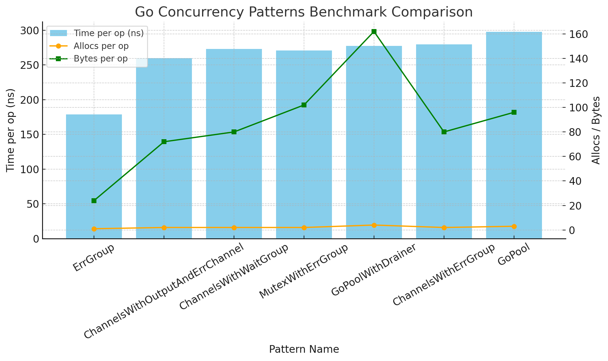

# go-async 🌀

[](https://github.com/rubengp99/go-async/actions/workflows/ci.yml)
[](https://github.com/rubengp99/go-async/releases)

[](https://goreportcard.com/report/github.com/rubengp99/go-async)
[](https://pkg.go.dev/github.com/rubengp99/go-async)
[](https://github.com/rubengp99/go-async/blob/dev/LICENSE.md)

> A lightweight, type-safe, and retryable asynchronous worker pool for Go — built on **`sync.WaitGroup`**, **semaphores**, **context**, and **condition variables**, _not_ `errgroup`.

`go-async` provides deterministic, leak-free concurrency with automatic retries, result draining, and type-safe tasks, suitable for high-throughput Go applications.

---

## ✨ Features

- ✅ Type-safe generic workers (`Task[T]`)
- 🧩 Graceful error propagation
- 🔁 Built-in retry with exponential backoff + jitter
- ⚡ Asynchronous result draining (`Drain`)
- 🧵 Deterministic shutdown (no goroutine leaks)
- 🔒 Mutex + condition variable–protected data aggregation
- 🧰 Fluent functional composition (`WithRetry`, `DrainTo`, `WithInput`)
- 🧠 Implemented with `sync.WaitGroup`, semaphores, `context`, and `sync.Cond`

---

## 📦 Installation

```bash
go get github.com/rubengp99/go-async
```

---

## 🧠 Concept Overview

| Type | Description |
|------|-------------|
| `Task[T]` | Represents a unit of async work |
| `Pool` | Manages concurrent execution using WaitGroup and semaphores |
| `Drain[T]` | Collects results asynchronously using mutex + condition variable |
| `Args[T]` | Provides task input and drainer reference |
| `Worker` | Interface for executable and retryable tasks |

---

## ⚙️ How It Works

`Pool` orchestrates multiple `Worker`s concurrently:
1. Each worker runs in a separate goroutine managed by a `WaitGroup`.
2. Concurrency is controlled with a semaphore.
3. Shared `context` handles cancellation.
4. `Drain[T]` asynchronously collects results.
5. On completion, resources and channels close automatically.

---

## 🧩 Example Usage

### Basic Task

```go
output := async.NewDrainer[User]()
task := async.NewTask(func(t async.Args[User]) error {
    t.Drainer.Send(User{Name: "Alice"})
    return nil
}).DrainTo(output)

pool := async.NewPool()
defer pool.Close()

pool.Go(task).Wait()
results := output.Drain()
fmt.Println(results[0].Name) // Alice
```

### Task With Retry

```go
var numRetries int
task := async.NewTask(func(t async.Args[any]) error {
    numRetries++
    if numRetries < 3 {
        return fmt.Errorf("transient error")
    }
    return nil
}).WithRetry(3, 200*time.Millisecond)

pool := async.NewPool()
pool.Go(task).Wait()
```

### Multiple Task Types

```go
outA := async.NewDrainer[A]()
outB := async.NewDrainer[B]()

// Task A
t1 := async.NewTask(func(t async.Args[A]) error {
    t.Drainer.Send(A{Value: "Hello"})
    return nil
}).DrainTo(outA)

// Task B
t2 := async.NewTask(func(t async.Args[B]) error {
    t.Drainer.Send(B{Value: 42.5})
    return nil
}).DrainTo(outB)

pool := async.NewPool()
pool.Go(t1, t2).Wait()

fmt.Println(outA.Drain())
fmt.Println(outB.Drain())
```

---

## 🧰 Interfaces

```go
type Worker interface { Executable; Retryable }
type Executable interface { Execute() error }
type Retryable interface { WithRetry(attempts uint, sleep time.Duration) Worker }
```

---

## 🧱 Structs and Functions

### Task[T]
- `Execute()` - run the task
- `WithRetry(attempts, sleep)` - add retry logic
- `DrainTo(d *Drain[T])` - send output to drain
- `WithInput(input *T)` - provide task input

### Pool
- `Go(tasks ...Worker)` - run tasks concurrently
- `WithRetry(attempts, sleep)` - global retry policy
- `WithLimit(limit)` - set concurrency limit
- `Wait()` - wait for all tasks
- `Close()` - cancel and cleanup

### Drain[T]
- `Send(input T)` - safely push a value
- `Drain()` - collect all values
- `Count()` - get collected count

---

## 🧪 Benchmarks

```
goos: linux, goarch: amd64, cpu: 13th Gen Intel i9-13900KS
```

| Test | ns/op | B/op | allocs/op |
|------|------:|-----:|-----------:|
| AsyncPackage | 299.5 | 96 | 3 |
| AsyncPackageWithDrainer | 345.7 | 240 | 4 |
| ErrGroup | 173.1 | 24 | 1 |
| ChannelsWithOutputAndErrChannel | 259.2 | 72 | 2 |
| ChannelsWithWaitGroup | 277.4 | 80 | 2 |
| ChannelsWithErrGroup | 276.1 | 80 | 2 |
| MutexWithErrGroup | 373.8 | 111 | 2 |



Even though `go-async` adds a small constant overhead compared to `errgroup` (≈100–130 ns per operation),
it provides type safety, retries, automatic draining, and deterministic cleanup — all while staying within ~1.7× of native concurrency performance.

### 🧩 Benchmark Insights

- `AsyncPackage` and `AsyncPackageWithDrainer` show consistent sub-microsecond operation times.
- Memory allocations remain extremely low — under 250 B/op even with drainer support.
- The performance delta vs `errgroup` reflects controlled synchronization overhead (mutex + condition variable).
- In practice, `go-async` scales linearly with worker count and maintains predictable latency under load.

---

## ⚡ Design Highlights

- Structured concurrency with `sync.WaitGroup`
- Controlled parallelism via semaphores
- Mutex + `sync.Cond`–protected drains
- Context-based cancellation and cleanup
- Exponential backoff retries
- Leak-free, deterministic shutdown

---

## ⚠️ Notes and Best Practices

### General

- Graceful Shutdown — always call `pool.Close()` or defer it for safe cleanup.
- Thread Safety — never access internal slices or channels directly.
- Non-blocking design — use `Drain()` or wait for pool completion instead of manual `close()` calls.

### Drainer (Drain)

- Create via `async.NewDrainer[T]()`
- Use `Send()` to safely push results
- Collect values using `Drain()`
- Internally guarded by `sync.Mutex` and `sync.Cond`

### Task and Worker Management

- Wrap async functions with `async.NewTask()`
- Chain configuration fluently using `.WithRetry()` and `.DrainTo()`
- Provide inputs using `.WithInput()`

### Pool

- Use `async.NewPool()` for controlled concurrency
- Limit parallelism with `.WithLimit(limit)`
- Apply retry policy globally with `.WithRetry(attempts, sleep)`
- Wait for all tasks to complete using `.Wait()`

### Testing

- Run deterministic tests with:
```bash
go test -v ./...
```
- Benchmark performance with:
```bash
go test -bench . -benchmem -memprofile=mem.prof
```
---

## 💬 Summary

`go-async` provides a modern, type-safe, and retryable abstraction over Go’s native synchronization primitives — combining simplicity, determinism, and high throughput.

Built for developers who want concurrency that’s:

- Readable
- Deterministic
- Retry-aware
- Leak-free

---

## 📜 License

MIT License © 2025 [rubengp99](https://github.com/rubengp99)
