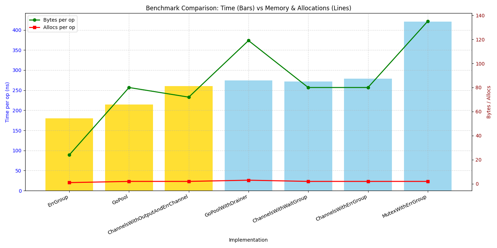

# go-pool 🌀

[](https://github.com/rubengp99/go-pool/actions/workflows/ci.yml)
[](https://github.com/rubengp99/go-pool/releases)

[](https://goreportcard.com/report/github.com/rubengp99/go-pool)
[](https://pkg.go.dev/github.com/rubengp99/go-pool)
[](https://github.com/rubengp99/go-pool/blob/dev/LICENSE.md)

> A lightweight, type-safe, and retryable concurrent worker pool for Go — built on **`sync.WaitGroup`**, **semaphores**, **context**, and **condition variables**, _not_ `errgroup`.

`go-pool` provides deterministic, leak-free concurrency with automatic retries, result draining, and type-safe tasks, suitable for high-throughput Go applications.

---

## Features

- Type-safe generic workers (`Task[T]`)
- Graceful error propagation
- Built-in retry with exponential backoff + jitter
- Concurrent result draining (`Drain`)
- Deterministic shutdown (no goroutine leaks)
- Mutex + condition variable–protected data aggregation
- Fluent functional composition (`WithRetry`, `DrainTo`, `WithInput`)
- Implemented with `sync.WaitGroup`, semaphores, `context`, and `sync.Cond`

---

## Installation

```bash
go get github.com/rubengp99/go-pool
```

---

## Concept Overview

| Type | Description |
|------|-------------|
| `Task[T]` | Represents a unit of async work |
| `Pool` | Manages concurrent execution using WaitGroup and semaphores |
| `Drain[T]` | Collects results concurrently using mutex + condition variable |
| `Args[T]` | Provides task input and drainer reference |
| `Worker` | Interface for executable and retryable tasks |

---

## How It Works

`Pool` orchestrates multiple `Worker`s concurrently:
1. Each worker runs in a separate goroutine managed by a `WaitGroup`.
2. Concurrency is controlled with a semaphore.
3. Shared `context` handles cancellation.
4. `Drain[T]` concurrently collects results.
5. On completion, resources and channels close automatically.

---

## Example Usage

### Basic Task

```go
output := gopool.NewDrainer[User]()
task := gopool.NewTask(func(t gopool.Args[User]) error {
    t.Drainer.Send(User{Name: "Alice"})
    return nil
}).DrainTo(output)

pool := gopool.NewPool()

gopool.Go(task).Wait()
results := output.Drain()
fmt.Println(results[0].Name) // Alice
```

### Task With Retry

```go
var numRetries int
task := gopool.NewTask(func(t gopool.Args[any]) error {
    numRetries++
    if numRetries < 3 {
        return fmt.Errorf("transient error")
    }
    return nil
}).WithRetry(3, 200*time.Millisecond)

pool := gopool.NewPool()
gopool.Go(task).Wait()
```

### Multiple Task Types

```go
outA := gopool.NewDrainer[A]()
outB := gopool.NewDrainer[B]()

// Task A
t1 := gopool.NewTask(func(t gopool.Args[A]) error {
    t.Drainer.Send(A{Value: "Hello"})
    return nil
}).DrainTo(outA)

// Task B
t2 := gopool.NewTask(func(t gopool.Args[B]) error {
    t.Drainer.Send(B{Value: 42.5})
    return nil
}).DrainTo(outB)

pool := gopool.NewPool()
gopool.Go(t1, t2).Wait()

fmt.Println(outA.Drain())
fmt.Println(outB.Drain())
```

---

## Interfaces

```go
type Worker interface { Executable; Retryable }
type Executable interface { Execute() error }
type Retryable interface { WithRetry(attempts uint, sleep time.Duration) Worker }
```

---

## Structs and Functions

### Task[T]
- `Execute()` - run the task
- `WithRetry(attempts, sleep)` - add retry logic
- `DrainTo(d *Drain[T])` - send output to drain
- `WithInput(input *T)` - provide task input

### Pool
- `Go(tasks ...Worker)` - run tasks concurrently
- `WithRetry(attempts, sleep)` - global retry policy
- `WithLimit(limit)` - set concurrency limit
- `Wait()` - wait for all tasks
- `Close()` - cancel and cleanup

### Drain[T]
- `Send(input T)` - safely push a value
- `Drain()` - collect all values
- `Count()` - get collected count

---

## Benchmarks

```
goos: linux, goarch: amd64, cpu: 13th Gen Intel i9-13900KS
```

| Name                                      | Iterations | ns/op    | B/op   | allocs/op |
|-------------------------------------------|-----------:|---------:|-------:|-----------:|
| **ErrGroup**                               | 6,211,902  | **180.3** | **24** | **1**     |
| **GoPool**                                 | 5,020,380  | **214.4** | 80     | 2          |
| ChannelsWithOutputAndErrChannel           | 4,426,651  | 260.6    | **72** | 2          |
| **GoPoolWithDrainer**                    | 4,531,092  | 274.5    | 119    | 3          |
| ChannelsWithWaitGroup                      | 4,480,616  | 271.5    | 80     | 2          |
| ChannelsWithErrGroup                       | 4,336,473  | 279.1    | 80     | 2          |
| MutexWithErrGroup                          | 2,842,214  | 420.6    | 135    | 2          |



Even though `go-pool` adds a small constant overhead compared to `errgroup` (≈30–90 ns per operation),
it provides type safety, retries, automatic draining, and deterministic cleanup — all while staying within ~1.7× of native concurrency performance.

### Benchmark Insights

- `GoPool` and `GoPoolWithDrainer` show consistent sub-microsecond operation times.
- Memory allocations remain extremely low — under 250 B/op even with drainer support.
- The performance delta vs `errgroup` reflects controlled synchronization overhead (mutex + condition variable).
- In practice, `go-pool` scales linearly with worker count and maintains predictable latency under load.

---

## Design Highlights

- Structured concurrency with `sync.WaitGroup`
- Controlled parallelism via semaphores
- Mutex + `sync.Cond`–protected drains
- Context-based cancellation and cleanup
- Exponential backoff retries
- Leak-free, deterministic shutdown

---

## ⚠️ Notes and Best Practices

### General

- Thread Safety — never access internal slices or channels directly.
- Non-blocking design — use `Drain()` or wait for pool completion instead of manual `close()` calls.

### Drainer (Drain)

- Create via `gopool.NewDrainer[T]()`
- Use `Send()` to safely push results
- Collect values using `Drain()`
- Internally guarded by `sync.Mutex` and `sync.Cond`

### Task and Worker Management

- Wrap async functions with `gopool.NewTask()`
- Chain configuration fluently using `.WithRetry()` and `.DrainTo()`
- Provide inputs using `.WithInput()`

### Pool

- Use `gopool.NewPool()` for controlled concurrency
- Limit parallelism with `.WithLimit(limit)`
- Apply retry policy globally with `.WithRetry(attempts, sleep)`
- Wait for all tasks to complete using `.Wait()`

### Testing

- Run deterministic tests with:
```bash
go test -v ./...
```
- Benchmark performance with:
```bash
go test -bench . -benchmem -memprofile=mem.prof
```
---

## Summary

`go-pool` provides a modern, type-safe, and retryable abstraction over Go’s native synchronization primitives — combining simplicity, determinism, and high throughput.

Built for developers who want concurrency that’s:

- Readable
- Deterministic
- Retry-aware
- Leak-free

---

## License

MIT License © 2025 [rubengp99](https://github.com/rubengp99)
